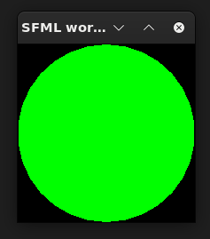
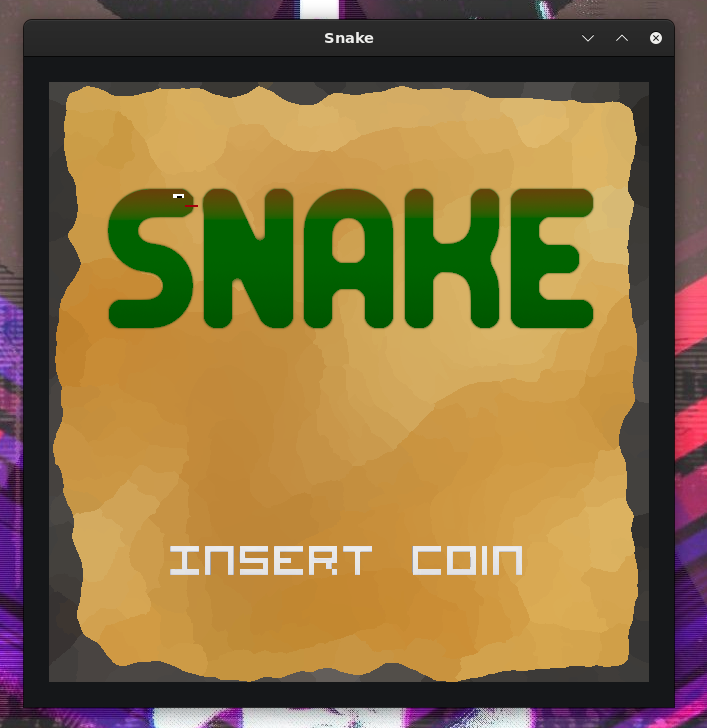

# SFML-VALA binding

vala binding of project SFML

[the documentation is here:](https://nda-cunh.gitlab.io/sfml-vala-binding/sfml/sf.html)

[https://nda-cunh.gitlab.io/sfml-vala-binding/sfml/sf.html](https://nda-cunh.gitlab.io/sfml-vala-binding/sfml/sf.html)

Exemple:



```vala
using sf;

void main()
{
    var window = new RenderWindow(VideoMode(200, 200), "SFML works!");
    var circle = new CircleShape();
    circle.setFillColor(Color.Green);
    circle.setRadius(100);

    while (window.isOpen())
    {
        Event event;
        while (window.pollEvent(out event))
        {
            if (event.type == EventType.Closed)
                window.close();
        }

        window.clear();
        circle.draw(window);
        window.display();
    }
}
```


simple snake in sfml-vala here:
https://gitlab.com/nda-cunh/snake-sfml


